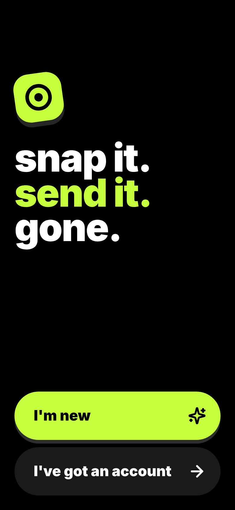
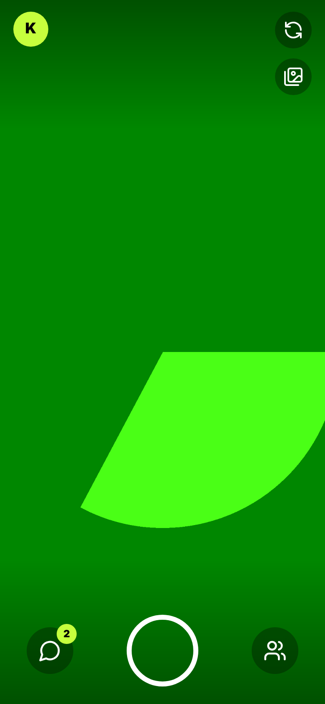
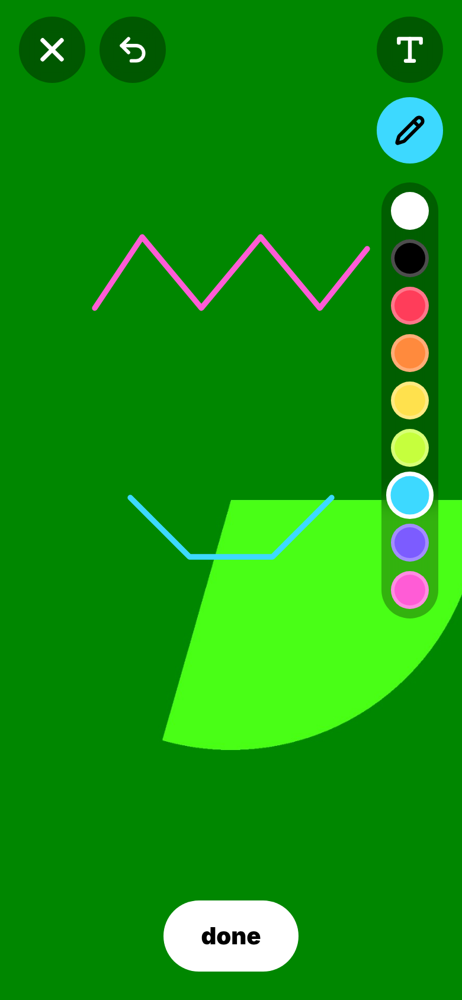
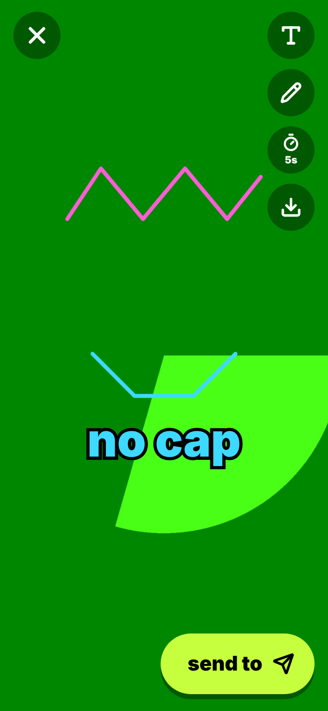
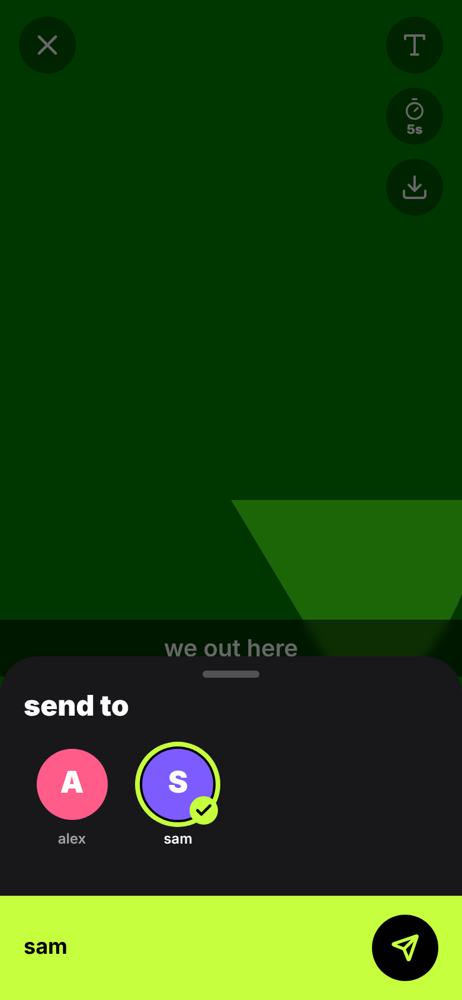
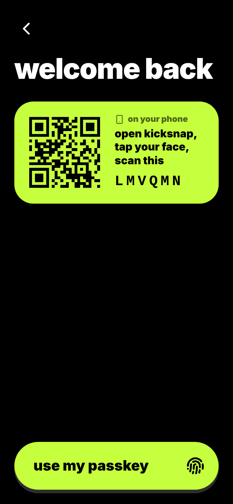
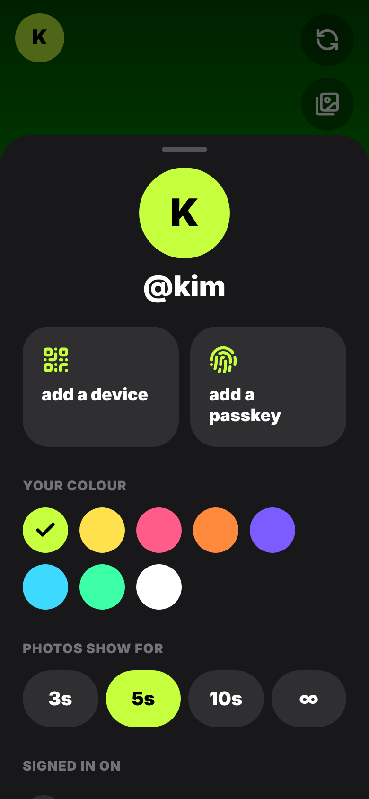

# Kiks

Self-hosted snap app. Open, snap, send. Snaps burn after they're viewed.

## What it feels like

- **Opens on the camera.** Tap the shutter for a photo, hold it for up to 10s of video. Tap to focus, double-tap to flip.
  Photos are full-resolution stills (the whole sensor frame, nothing cropped).
- **Swipe, don't navigate.** Swipe right for chats, left for friends. No menus.
- **Snap, then play.** Draw on it in 9 colours, add text (tap T again for big outlined text), drag it around.
- **Send.** Tap the timer for 3s / 5s / 10s / ∞, hit send, tap faces.
- **Snap back.** Open a snap, hit "snap back", and the next one goes straight to that person.
- **No passwords, ever.** A new device either says "I'm new" (then you pick a name) or "I've got an account".
  Then you either use a passkey, or scan the QR it shows from a phone that's already signed in.
- **Add friends by QR.** Your code is on the friends screen. Scan theirs, or type their name.
- **Notifications.** Push for new snaps and friend requests, even with the app closed. Pull down on chats or friends to refresh.

## Screens

<p>
   
   
</p>

## Run it

```bash
cp .env.example .env
docker compose up -d --build
```

Open http://localhost:8080.

Browsers only give camera access, passkeys and push on `https://` or `localhost`, so to use it from a phone put
it behind a TLS reverse proxy (Caddy, Traefik, Pangolin, nginx...). Proxy examples, backups and upgrades are in
[docs/deploy.md](docs/deploy.md).

Data (SQLite + media) lives in the `kicksnap-data` volume at `/data`. Back up `kicksnap.db` and `vapid.pem`:
`docker compose exec -T kiks python -m app.admin backup --keep 14`.

Release images are published as `ghcr.io/robotman4/kiks:<version>` (see [CHANGELOG.md](CHANGELOG.md)).

### Notifications

Web Push with VAPID, no third-party service of your own needed (the browser's push service delivers it).
The VAPID key is generated on first start and stored as `/data/vapid.pem`; keep it, or every device has to
turn notifications on again. Payloads only say who sent something, never the snap.

- **iPhone:** Apple only allows web push for apps added to the home screen (Share → Add to Home Screen, iOS 16.4+).
  Settings says so when it's opened in a normal Safari tab.
- **Android:** works in Chrome, installed or not.
- Set `VAPID_SUBJECT` to a `mailto:` or `https:` URL you own (Apple rejects some placeholders).

### Sign-in

- Each browser gets a random device secret in an `httpOnly` cookie. Only its SHA-256 is stored.
- Linking a device: the new one shows a 6-character code (and QR), valid 5 minutes. A signed-in device scans
  it (or types it) and approves. The new device's poll then gets its own cookie.
- Passkeys are WebAuthn, discoverable credentials. The relying-party ID defaults to the request host; set `RP_ID`
  if you serve on several hostnames. Passkeys need HTTPS (or `localhost`).
- Signed-in devices are listed under your face → "signed in on". Remove any from there.
- Accounts that never pick a name are deleted after a day.
- Native apps and scripts use the same device secret as a bearer token instead of a cookie (see API below).

## End-to-end encryption

Snaps and chats are end-to-end encrypted: the server stores ciphertext and public keys only. Every device has its
own key; the account's identity key signs the list of its devices and moves to a new device inside the QR link.
Friends get a "key changed" notice if it ever changes, and scanning each other's code in person verifies them.
Reports still work: the reporter's app sends what it decrypted, and the server checks the sender's signature.

Protocol (for other clients, like the Android app): [docs/e2e.md](docs/e2e.md), with test vectors in
[docs/e2e-vectors.json](docs/e2e-vectors.json).

## Android and iPhone app

A native Flutter app lives in [app/](app/README.md): same accounts, same encryption, signs in by scanning a QR
from a device that's already signed in. The newest Android test build is at
[releases/android-latest](https://github.com/robotman4/kicksnap/releases/tag/android-latest). iPhone builds
are made on a Mac with Xcode (steps in [app/README.md](app/README.md)).

## How snaps burn

- A snap's media is deleted from disk once every recipient has opened it.
- Anything unopened after `SNAP_TTL_HOURS` (default 24) is deleted.
- The sender only ever sees "delivered" / "opened". There is no history.

## Moderation

Nobody is admin by default. Whoever runs the server grants it from the shell:

```bash
docker compose exec kiks python -m app.admin grant kim     # revoke / list too
docker compose exec kiks python -m app.admin reports       # open reports
docker compose exec kiks python -m app.admin suspend sam --days 7 --reason "harassment"
docker compose exec kiks python -m app.admin appeals       # open appeals; lift with unsuspend
docker compose exec kiks python -m app.admin delete sam    # --free-name to not reserve it
docker compose exec kiks python -m app.admin reserve ceo "impersonation"
```

- Admins get an "admin" tile in their profile: open appeals and reports (with any snap, texts and screenshots the
  reporter attached), user search, reserved names and a log of every admin action.
- Reporting is in the app (snap viewer flag, tapping someone's text, or a friend's chat options). It blocks by
  default. Picked texts are copied into the report, since texts burn after 24h. No email, no
  scores; the "friends who reported" count only sorts the queue. Admins get one push when the queue (reports and
  appeals) goes from empty to not empty.
- Suspend (optionally for N days) keeps the account but locks it; friends see "unavailable". The suspended person
  sees the reason (what they were reported for, unless you give one) and can send one appeal per suspension.
  Admins lift it or keep it, with a short answer the person sees. Delete wipes it and
  by default reserves the name.
- People who delete their own account get their name held for `NAME_COOLDOWN_DAYS` (default 30), then freed.
- If anyone reports illegal content (for example child sexual abuse material), you have to act on it and may be
  legally required to report it where you live. Don't just dismiss it.

## Develop

```bash
# api on :8000
cd backend && python -m venv .venv && . .venv/bin/activate && pip install -r requirements.txt
DATA_DIR=./data uvicorn app.main:app --reload

# web on :5173, proxies /api and /ws to :8000
cd frontend && npm install && npm run dev

# tests
cd backend && pip install -r requirements-dev.txt && python -m pytest
cd frontend && npm test   # web crypto against docs/e2e-vectors.json
```

## API

- Everything lives under `/api/v1` (realtime socket: `/api/v1/ws`). Old `/api/...` and `/ws` paths are aliases
  for v1, so existing clients keep working. A breaking change ships as `/api/v2` next to it.
- Docs: http://localhost:8000/api/v1/docs (OpenAPI at `/api/v1/openapi.json`).
- Auth is either the `ks_device` cookie (the web app) or `Authorization: Bearer <secret>`, on HTTP and the socket.
- To get a secret without a cookie, send `X-Kiks-Auth: bearer` on the call that signs a device in
  (`POST /devices/new`, the `GET /link/{code}` poll, `POST /passkeys/login/finish`). The response then carries
  `"token"` and no cookie is set. Store it in the Keychain/Keystore. `POST /auth/logout` with it revokes it.

## Contributing, security, license

See [CONTRIBUTING.md](CONTRIBUTING.md). Report vulnerabilities privately as described in [SECURITY.md](SECURITY.md).

Kiks is licensed under the [GNU AGPL-3.0](LICENSE). If you run a modified version as a service, you must offer
its source to your users.

## Stack

FastAPI + SQLite on the back, React + Vite + Tailwind PWA on the front, one container.
