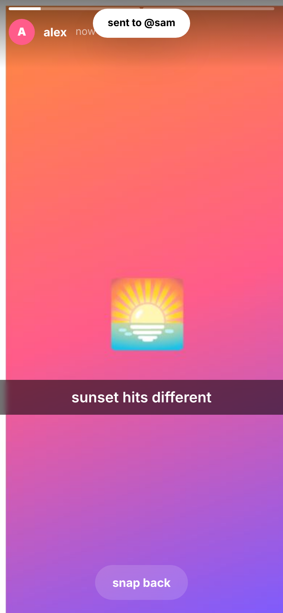
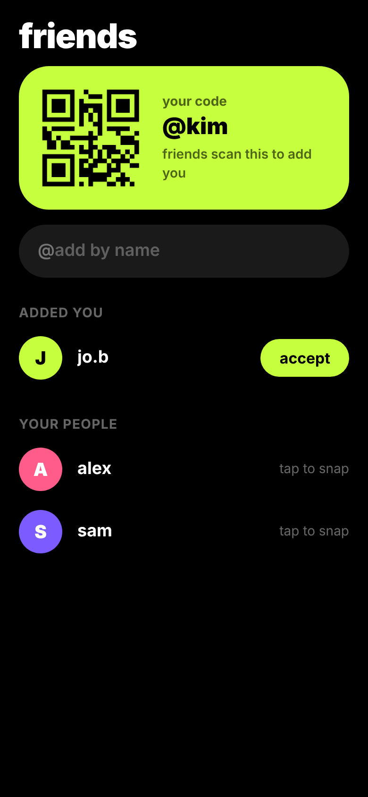
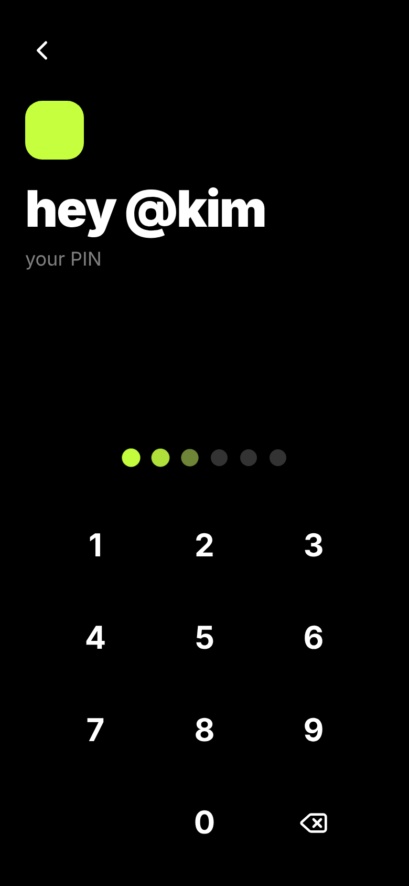

# kicksnap

Self-hosted snap app. Open, snap, send. Snaps burn after they're viewed.

## What it feels like

- **Opens on the camera.** Tap the shutter for a photo, hold it for up to 10s of video. Double-tap to flip.
- **Swipe, don't navigate.** Swipe right for chats, left for friends. No menus.
- **Snap, then send.** Tap to add a caption, tap the timer to pick 3s / 5s / 10s / ∞, hit send, tap faces.
- **Snap back.** Open a snap, hit "snap back", and the next one goes straight to that person.
- **No forms.** Sign-in is your name plus a 6-digit PIN. New name = new account, same screen.
- **Add friends by QR.** Your code is on the friends screen. Scan theirs, or type their name.

## Screens

<p>
  
  
</p>

## Run it

```bash
cp .env.example .env
docker compose up -d --build
```

Open http://localhost:8080.

Browsers only give camera access on `https://` or `localhost`. To use it from a phone, put it behind a TLS
reverse proxy. Caddy, for example:

```caddyfile
snap.example.com {
    reverse_proxy kicksnap:8000
}
```

WebSockets (`/ws`) pass through Caddy with no extra config.

Data (SQLite + media) lives in the `kicksnap-data` volume at `/data`.

## How snaps burn

- A snap's media is deleted from disk once every recipient has opened it.
- Anything unopened after `SNAP_TTL_HOURS` (default 24) is deleted.
- The sender only ever sees "delivered" / "opened". There is no history.

## Develop

```bash
# api on :8000
cd backend && python -m venv .venv && . .venv/bin/activate && pip install -r requirements.txt
DATA_DIR=./data uvicorn app.main:app --reload

# web on :5173, proxies /api and /ws to :8000
cd frontend && npm install && npm run dev
```

API docs: http://localhost:8000/api/docs

## Stack

FastAPI + SQLite on the back, React + Vite + Tailwind PWA on the front, one container.
